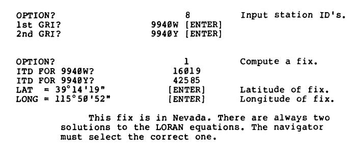

# LoranC

## TRS-80 Model 100 Emulator

http://bitchin100.com/wiki/index.php?title=CloudT_Web_Emulator

---

1. Navigate to "BASIC"
2. Load code from https://github.com/Auios/LoranC/blob/main/LORAN into the "cassette tape"
3. You can upload the file in two ways. You can upload the file using the upload file option or you can copy paste the file into the plain text box. Either method you will need to use the file's name. Use `CLOAD "LORAN"` to load the file from the "cassette" into the machine's memory.
4. Use `RUN` to run the program.
5. Use option 8 to set the `Chain` / `GRI`
7. Use option 1 to convert LORAN numbers to Lat/Lon

Try using the examples on page 31 (PDF Page 40/53) of the `ADA137009.pdf` document.

## Manual on using the program

https://apps.dtic.mil/sti/pdfs/ADA137009.pdf

I highly recommend reading this PDF starting on page 1 (or 10 in the PDF file). It will explain the quirks of the program and necessary steps to take in order. It also gives sample input/output. Copying step by step what is done in this book you should get the same exact results.

## Manual on the TRS-80 Model 100
If you want to learn more about the computer itself then this manual will do you well.

https://ftp.whtech.com/club100/doc/TRS80-M100-User-Guide.pdf
